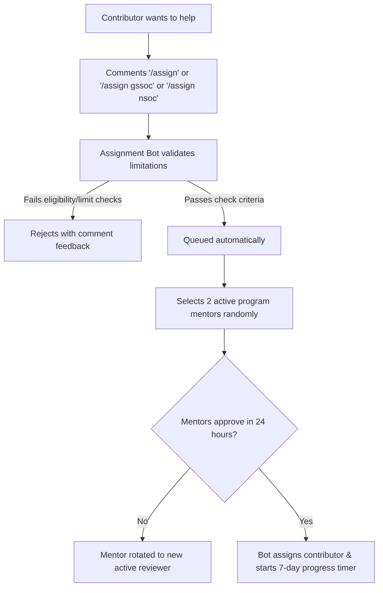
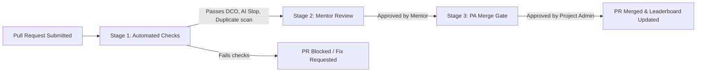

# Contributing to GSoC Org Finder

---

## 🌐 Navigation
[🏠 Home (README)](README.md) • [🤝 Contributing Guide](CONTRIBUTING.md) • [📜 Code of Conduct](CODE_OF_CONDUCT.md) • [🛡️ Security Policy](SECURITY.md) • [📚 General Contributor Guide](docs/GENERAL_CONTRIBUTOR_GUIDE.md)

---

## 📖 Table of Contents
- [Program-Specific Guides](#-program-specific-guides)
- [Project Philosophy](#-project-philosophy)
- [Local Development & Environment Setup](#-local-development--environment-setup)
- [Coding Standards & Linters](#-coding-standards--linters)
- [Issue Assignment Workflow](#-issue-assignment-workflow)
- [The Automated Stage Triage Pipeline](#-the-automated-stage-triage-pipeline)
- [Smart Review Pipeline](#-smart-review-pipeline)
- [Pull Request Checklist](#-pull-request-checklist)
- [Inactivity & Maintainer Ping Policies](#-inactivity--maintainer-ping-policies)

---

## 📚 Program-Specific Guides

If you are participating under a structured program, please follow the guidelines specified for your track:

| Program / Track | Purpose | Detailed Track Guide |
| :--- | :--- | :--- |
| **GSSoC'26 Contributors** | GirlScript Summer of Code 2026 track | [GSSoC Contributor Guide](docs/GSSOC_CONTRIBUTOR_GUIDE.md) |
| **GSSoC'26 Mentors** | Mentorship instructions and rotation | [GSSoC Mentor Guide](docs/GSSOC_MENTOR_GUIDE.md) |
| **NSoC'26 Contributors** | Nexus Spring of Code 2026 track | [NSoC Guide](docs/NSOC_GUIDE.md) |
| **General Contributors** | Open source contributions outside formal tracks | [General Contributor Guide](docs/GENERAL_CONTRIBUTOR_GUIDE.md) |

---

## ✨ Project Philosophy

This codebase operates on four cornerstone principles:
1.  **Zero-Build Philosophy** — No compilers, transpilers, webpacks, or hydration frameworks. The frontend is vanilla HTML5, CSS3, and ES6 Javascript.
2.  **Minimal Dependency Philosophy** — Do not introduce external npm packages unless absolute business necessity demands it.
3.  **Static-First Architecture** — Build fast, responsive pages that can be hosted on any static CDN.
4.  **Edge-Runtime Proxy Functions** — Perform necessary server interactions via Vercel Edge Functions to avoid exposing secret tokens.

---

## 🛠️ Local Development & Environment Setup

Follow these steps to run a full development environment including API proxy services:

### 1. Clone & Set Tokens
Create a Personal Access Token (PAT) on GitHub and set it inside a `.env` file:
```bash
git clone https://github.com/S3DFX-CYBER/GSoC-Org-Finder-.git
cd GSoC-Org-Finder-
echo "GITHUB_TOKEN=ghp_your_token_here" > .env
```

### 2. Start Vercel Edge Runtime Dev
For live stats, search indices, and API mocks, run the Vercel emulator locally:
```bash
# Global Vercel CLI install
npm install -g vercel

# Run development server
vercel dev
```
The server starts at `http://localhost:3000`.

---

## 📏 Coding Standards & Linters

To maintain maximum code quality and formatting consistency, this project enforces strict linting rules. Ensure your contributions pass all validations before committing:

*   **JavaScript Linting (`.eslintrc.json`)** — Verifies variable scoping, ES module standard, clean indenting, and prevents deprecated syntax patterns.
*   **CSS Linting (`.stylelintrc.json`)** — Keeps properties ordered, prevents nesting overflow, and standardizes visual variables.
*   **HTML Linting (`.htmlhintrc`)** — Checks semantic structures, tag closures, tag structure validity, and correct accessibility tags.

---

## 📋 Issue Assignment Workflow

The repository relies on a mentor-assisted automated assignment pipeline. Do **not** comment begging to be assigned, and **never** attempt manual assignment using the GitHub UI.



### 🏷️ Difficulty Level Rules
To match experience levels, auto-assignment rules are strictly governed:

| Difficulty Level | Label Criteria | Auto-Assignment Eligibility |
| :--- | :--- | :--- |
| **Beginner** | `level:beginner` / `level1` | Anyone may request assignment. Ideal for docs, UI spacing, or standard fixes. |
| **Intermediate** | `level:intermediate` / `level2` | Your GitHub account must be at least **30 days old** to auto-assign. |
| **Advanced** | `level:advanced` / `level3` | Requires at least **1 previously merged PR** in this repository. |

### 🛑 Active Assignment Limit
To keep the environment fair for all, contributors can only have a maximum of **3 active assigned issues** at any single time.

---

## 🚦 The Automated Stage Triage Pipeline

All pull requests pass through an automated 3-stage validation pipeline:



---

## 🔍 Smart Review Pipeline

### 🤖 Stage 1: Automated Checks
Before a human ever looks at your PR, GitHub Actions run the following automation:
*   **Developer Certificate of Origin (DCO)** — Every commit must be signed off. Commit using `git commit -s -m "type: message"`.
*   **AI-Slop & Spam Detection** — Automated scripts analyze contributions to reject generic autogenerated filler, low-effort documentation spam, or copy-paste code.
*   **PR Size Boundaries** — Automatically labels PR size so reviewers know what to expect.
*   **TENET AI Code Review Agent** — Automatically runs deep diff audits using Google Gemini (`gemini-2.5-flash`) to flag potential bugs, architecture deviations, and labels high severity reports as `🚨 security`.

### 👥 Stage 2: Mentor Review
Once Stage 1 is fully completed and green, two active mentors are automatically selected to review your implementation.
*   Mentors review for code cleanlines, vanilla design patterns, and responsive layout compatibility.
*   Mentors have **24 hours** to complete reviews before they are rotated out.
*   Review approvals are registered by commenting `/approve-pr` or `/lgtm`.

### 🔑 Stage 3: Project Admin Final Gate
*   The Project Admin (**@S3DFX-CYBER**) coordinates the final merge checks.
*   Merges automatically sync and post updates to the automated **Contributor Leaderboard** and **Mentor Leaderboard**.

---

## 📝 Pull Request Checklist

Ensure all items are checked before filing your PR:
*   [ ] I have been officially assigned to the linked issue by the automated bot.
*   [ ] My PR includes the precise closing reference in the description (e.g. `Closes #142`).
*   [ ] All commits are signed off (`git commit -s`).
*   [ ] The codebase compiles/runs locally with zero errors under style linting.
*   [ ] Commit messages adhere to the **Conventional Commit** format (e.g., `feat: details`, `fix: details`).
*   [ ] Unrelated code adjustments, folder changes, or dependency introductions have been avoided.

---

## 🕒 Inactivity & Maintainer Ping Policies

### 💤 Inactivity Expiry (7-Day Limit)
If there is no progress (linked PR, descriptive status updates, or draft commits) on an assigned issue for **7 days**, the issue is automatically unassigned.
*   To manually release an issue you cannot complete, comment `/unassign`.
*   Once unassigned due to inactivity, you must wait **24 hours** before requesting assignment on that issue again.

### 🔇 Maintainer/Mentor Ping Etiquette
Please do **not** tag maintainers or mentors repeatedly. Reviews are managed automatically.
*   Allow **24 hours** for Mentor actions (rotations are automated).
*   Allow **24–72 hours** for Project Admin review and merge cycles.
