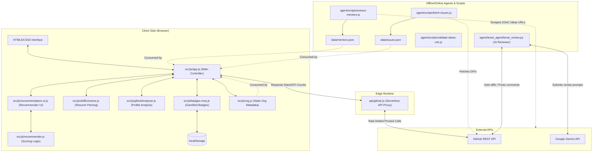

# 🚀 GSoC 2026 Org Finder

---

## 🌐 Navigation
[🏠 Home (README)](README.md) • [🤝 Contributing Guide](CONTRIBUTING.md) • [📜 Code of Conduct](CODE_OF_CONDUCT.md) • [🛡️ Security Policy](SECURITY.md) • [📚 General Contributor Guide](docs/GENERAL_CONTRIBUTOR_GUIDE.md)

---

> **Find your perfect Google Summer of Code 2026 organization — filtered by tech stack, domain, competition level, and live GitHub activity.**


**Live site → [https://findmygsoc.vercel.app/](https://findmygsoc.vercel.app/)**  
Join our Channel for community-related questions and feedback:  
**Discord → [https://discord.gg/mgWV3xSV7](https://discord.gg/mgWV3xSV7)**

---

## ✨ What is this?

A fast, beautiful, single-page application that helps GSoC 2026 applicants search, filter, and compare all **184 selected organizations** to instantly find the ones that match *their* skills and interests.

No sign-up. No install. No build step. Just open and explore.

---

## 📖 Table of Contents

- [What is this?](#-what-is-this)
- [Interactive System Architecture](#-interactive-system-architecture)
- [Folder & Module Responsibilities](#-folder--module-responsibilities)
- [Core Features](#-core-features)
- [Tech Stack](#-tech-stack)
- [Local Development & Quick-Start](#-local-development--quick-start)
- [API Reference (`/api/github.js`)](#-api-reference-apigithubjs)
- [URL Validation](#-url-validation)
- [Troubleshooting & FAQ](#-troubleshooting--faq)
- [Contributing & PR Review Pipeline](#-contributing--pr-review-pipeline)
- [Project Admin & GSSoC Mentors](#-project-admin--gssoc-mentors)
- [GSoC 2026 Key Dates](#-gsoc-2026-key-dates)
- [License](#-license)

---

## 📊 Interactive System Architecture

The following diagram illustrates how the frontend components, static assets, Vercel Edge Serverless Function proxy, automated scrapers, and the security AI code review agent (`tenet_agent`) interact within the ecosystem.



---

## 📁 Folder & Module Responsibilities

This repository operates on a **zero-build, static-first** architectural philosophy. Here is a breakdown of the key files and directories:

| Directory/File | Responsibility | Key Files / Logic |
| :--- | :--- | :--- |
| **`index.html`** | Main Single Page Application | Structures the entire dashboard, details modals, analytics view, and standard layouts. |
| **`src/styles.css`** | Application Stylesheet | Responsive styling across three breakpoints (phone, tablet, desktop). Includes the variables and dark/light color systems. |
| **`src/js/app.js`** | Main Application Controller | Coordinates search, filtering algorithms, countdown timer, detail modals, and dashboard event listener wiring. |
| **`src/js/org.js`** | Organization Data Layer | The static database containing 184 GSoC organizations, their domains, tags, competition metrics, and metadata. |
| **`src/js/recommender.js`** | AI Recommender Engine | Scores and recommends matching organizations based on user skills, topics, and GitHub profiles. |
| **`src/js/badges-mvp.js`** | Gamification Badge System | Tracks user explore/compare metrics in `localStorage` and rewards achievements via non-blocking toast animations. |
| **`api/github.js`** | Vercel Edge Serverless Function | Proxies all client-side calls to the GitHub API, handling rate-limiting and hiding token values. Caches outputs for 1 hour. |
| **`agent/scripts/`** | Automation & Maintenance Scripts | Helper scripts for scraping, cache updates, and ideas URL format verification. |
| **`agent/tenet_agent/`** | TENET Pull Request Security Reviewer | Python AI agent leveraging Google Gemini Flash (`gemini-2.5-flash`) to automatically review PR diffs and flag vulnerabilities. |
| **`data/`** | Cached JSON Data Store | Holds caches like `mentors.json` (extracted mentor handles) and `issues.json` (good first issues index). |
| **`.github/workflows/`** | CI/CD & Automation System | A suite of 37 workflows governing PR stage management, stale PR checks, mentor rotations, and assignment queues. |

---

## 🎯 Core Features

### 🔍 Discovery & Filtering
*   🔎 **Full-Text Search** — Instantly search across 184 organizations by name, technology stack, topics, or domains.
*   🏷️ **Domain Filtering** — Fast categorization under Web, Science, Operating Systems, Security, AI, Data, Infrastructure, Dev Tools, and more.
*   💻 **Multi-Select Tech Stack Pills** — Stack multiple languages (Rust, Python, Go, C++, etc.) for combined target matching.
*   ⚡ **Smart Filters** — Filter by Veterans (long-term GSoC participants), Newcomers, High/Low competition, and Actively Maintained.
*   📊 **Flexible Sorting** — Alphabetical, GSoC Experience, Newcomer-Friendly, Competition Level, Star Count, and Good First Issues availability.

### 📊 Live GitHub Metrics Integration
*   🌟 **Live GitHub Stats** — Stars, Forks, Open Issues, and Last Commit dates fetched on demand through `/api/github.js`.
*   🟢 **Good First Issues Tracker** — Sort and filter organizations by their beginner-friendly issue counts.
*   🎖️ **Activity Indicators** — Highlights repos as Active, Moderate, or Low based on commits to identify responsive organizations.
*   🔗 **Smart Repo Routing** — Detects single-project orgs (routing straight to the repo) vs umbrella orgs (routing to the GitHub organization portal).

### ⚖️ Comparison Mode
*   🏆 Select up to **3 organizations** to analyze side-by-side.
*   📊 Side-by-side review of domain category, GSoC history, competition pace, stars, forks, open issues, active commits, and language compatibility.
*   🟢 Green and 🔴 red highlights automatically flag best and worst values in each metric category.

### ⏱️ Deadline Countdown
*   ⏰ A dynamic navbar countdown alert showing days remaining until the GSoC student application window opens (March 16, 2026).
*   🔄 Automatically updates to display "Applications Closing In" during the open application window (March 16 - April 8).

### ⌨️ Keyboard Accessibility
*   `↑ ↓ ← →` — Seamlessly shift focus across card selections.
*   `Enter` — Open detail modal for the currently selected card.
*   `C` — Toggle comparison inclusion of the card.
*   `Esc` — Close modal panels.

---

## 🛠️ Tech Stack

| Component | Architecture & Technologies |
| :--- | :--- |
| **Frontend UI** | Vanilla HTML5 / Vanilla CSS3 / Modern ES Modules |
| **Hosting** | Vercel Static Hosting |
| **Serverless API** | Vercel Edge Serverless Function (`api/github.js`) |
| **Data Layers** | Static JSON, local storage analytics, and live GitHub REST proxies |
| **AI PR Agent** | Python / Google Gemini 2.5 Flash / GitHub Actions Runner |

---

## 🚀 Local Development & Quick-Start

### Prerequisites
*   [Node.js](https://nodejs.org/) (v18 or higher recommended)
*   A [GitHub Personal Access Token (PAT)](https://github.com/settings/tokens) (No scopes required except `public_repo` to prevent API rate limits).

### 1. Clone & Setup
```bash
git clone https://github.com/S3DFX-CYBER/GSoC-Org-Finder-.git
cd GSoC-Org-Finder-
```

### 2. Configure Environment Variables
Create a `.env` file in the root directory (or set environment variables in your terminal) to allow live stats and Good First Issues page to load:
```env
GITHUB_TOKEN=ghp_your_personal_access_token_here
```

### 3. Running Locally

#### Option A: Lightweight Dev (No API proxy)
You can open `index.html` directly in your browser. Live GitHub stats will not load, but all static filters and organization comparisons will work fully:
```bash
# On macOS
open index.html
# On Windows (PowerShell)
Start-Process index.html
```

#### Option B: Full Edge Dev (Simulates live stats APIs)
To test Vercel Edge Serverless function features locally:
1. Install [Vercel CLI](https://vercel.com/cli) globally:
   ```bash
   npm install -g vercel
   ```
2. Link project and start dev server:
   ```bash
   vercel dev
   ```
This maps the client interface to `http://localhost:3000` and enables `/api/github` serverless proxy endpoints.

---

## 🔌 API Reference (`/api/github.js`)

The `/api/github.js` serverless function acts as a proxy to retrieve public data safely.

| Endpoint | Query Parameters | Description |
| :--- | :--- | :--- |
| `GET /api/github` | `?repo=owner/repo` | Returns stars, forks, open issues, last commit text, and commit activity speed. |
| `GET /api/github` | `?repo=owner/repo&gfi=1` | Fast endpoint to fetch Good First Issues count (cached separately). |
| `GET /api/github` | `?repo=owner/repo&gfi=1&issues=1` | Returns details on up to 30 active Good First Issues. |
| `GET /api/github` | `?user=username` | Parses public user profiles to feed recommendations in the Recommender tool. |

> [!NOTE]
> All external GitHub API outputs are cached on the Vercel Edge CDN for **1 hour** to keep page loads fast and comply with rate limit policies.

---

## 🔒 URL Validation

All ideas links must match strict security formatting before inclusion in `src/js/org.js`. Contributors should run the safety check prior to opening a PR:
```bash
node agent/scripts/validate-ideas-urls.js
```
The script runs checks to confirm:
*   ✅ Safe protocols only (`http` or `https`).
*   ✅ Formal URL construction.
*   ⚠️ Detection of placeholders or generic GSoC umbrella URLs.

---

## 🐛 Troubleshooting & FAQ

#### Live GitHub Stats (Stars, Forks, GFIs) display "—" or fail to load?
*   **Cause:** Your local dev server has exceeded the GitHub anonymous API rate limit (60 requests per hour).
*   **Fix:** Ensure you have created a Personal Access Token and successfully exposed `GITHUB_TOKEN` to your terminal environment or `.env` file before running `vercel dev`.

#### Local dev proxy function yields an internal server error?
*   **Cause:** Unlinked Vercel context or local port conflict.
*   **Fix:** Run `vercel link` followed by `vercel dev` again to synchronize configuration bindings.

#### My organization ideas URL is marked as placeholder?
*   **Cause:** The URL matches typical generic templates (e.g. `summerofcode.withgoogle.com`).
*   **Fix:** Replace it with the specific project ideas markdown file, wiki page, or dedicated site hosted by that organization.

---

## 🤝 Contributing & PR Review Pipeline

We welcome contributions! Please review our [CONTRIBUTING.md](CONTRIBUTING.md) before submitting.

### 🚦 The 3-Stage PR Pipeline

All pull requests pass through three review stages before merge:

| Stage | Evaluator | Focus |
| :--- | :--- | :--- |
| **Stage 1** | Automated Workflows | Validates Developer Certificate of Origin (DCO), verifies formatting, duplicate PR scans, and executes the **TENET AI Agent** security diff audit. |
| **Stage 2** | Program Mentors | Conducts human code reviews, validates functionality, checks vanilla alignment, and verifies responsive layouts. |
| **Stage 3** | Project Admin | Final administrative validation, code synchronization, and official merge decisions. |

> [!IMPORTANT]
> The automated Stage 1 checks must fully pass before mentors are assigned. Keep commits tidy, always sign off using `git commit -s`, and reference a valid issue (`Closes #123`).

---

## 👥 Project Admin & GSSoC Mentors

### 🔑 Project Admin
<a href="https://github.com/S3DFX-CYBER"></a>  
**[@S3DFX-CYBER](https://github.com/S3DFX-CYBER)** — Project Admin for GSSoC'26 and NSoC'26. Responsible for final merge decisions, mentor coordination, and code quality.

### 👥 GSSoC Mentors
These mentors guide contributors and review code changes:

<!-- GSSOC_MENTORS_START -->
<a href="https://github.com/12fahed"></a>
<a href="https://github.com/4f4d"></a>
<a href="https://github.com/aanjalii01"></a>
<a href="https://github.com/adithyan-css"></a>
<a href="https://github.com/AditthyaSS"></a>
<a href="https://github.com/AnirbansarkarS"></a>
<a href="https://github.com/AnirudhPhophalia"></a>
<a href="https://github.com/anubhavxdev"></a>
<a href="https://github.com/Anushreebasics"></a>
<a href="https://github.com/aryanbhutani26"></a>
<a href="https://github.com/ayu-yishu13"></a>
<a href="https://github.com/Ayush-Patel-56"></a>
<a href="https://github.com/Ayushh-Sharmaa"></a>
<a href="https://github.com/Balaji91221"></a>
<a href="https://github.com/BandhiyaHardik"></a>
<a href="https://github.com/coder-zs-cse"></a>
<a href="https://github.com/CoderOggy78"></a>
<a href="https://github.com/deepak0x"></a>
<a href="https://github.com/deepaksinghh12"></a>
<a href="https://github.com/DevROHIT11"></a>
<a href="https://github.com/Haile-12"></a>
<a href="https://github.com/itsdakshjain"></a>
<a href="https://github.com/JoeCelaster"></a>
<a href="https://github.com/kallal79"></a>
<a href="https://github.com/KaranGupta2005"></a>
<a href="https://github.com/knoxiboy"></a>
<a href="https://github.com/Kota-Jagadeesh"></a>
<a href="https://github.com/KUMARNiru007"></a>
<a href="https://github.com/lourduradjou"></a>
<a href="https://github.com/lovestaco"></a>
<a href="https://github.com/magic-peach"></a>
<a href="https://github.com/Manan-Chawla"></a>
<a href="https://github.com/Maxd646"></a>
<a href="https://github.com/MAYANKSHARMA01010"></a>
<a href="https://github.com/Mohit-368"></a>
<a href="https://github.com/morningstarxcdcode"></a>
<a href="https://github.com/Mrigakshi-Rathore"></a>
<a href="https://github.com/MUKUL-PRASAD-SIGH"></a>
<a href="https://github.com/Neilblaze"></a>
<a href="https://github.com/nihalawasthi"></a>
<a href="https://github.com/oasis-parzival"></a>
<a href="https://github.com/piyushdotcomm"></a>
<a href="https://github.com/Precise-Goals"></a>
<a href="https://github.com/preetbiswas12"></a>
<a href="https://github.com/rounakkraaj-1744"></a>
<a href="https://github.com/sabeenaviklar"></a>
<a href="https://github.com/Sagar-Datkhile"></a>
<a href="https://github.com/Satya900"></a>
<a href="https://github.com/saurabh24thakur"></a>
<a href="https://github.com/Shravanthi20"></a>
<a href="https://github.com/sparshagarwal0411"></a>
<a href="https://github.com/SparshM8"></a>
<a href="https://github.com/stealthwhizz"></a>
<a href="https://github.com/subratamondalnsec"></a>
<a href="https://github.com/Suvanwita"></a>
<a href="https://github.com/SyedImtiyaz-1"></a>
<a href="https://github.com/TarunyaProgrammer"></a>
<a href="https://github.com/thakurutkarsh22"></a>
<a href="https://github.com/uddalak2005"></a>
<a href="https://github.com/vanshaggarwal07"></a>
<!-- GSSOC_MENTORS_END -->

---

## 📅 GSoC 2026 Key Dates

| Date | Milestone |
| :--- | :--- |
| **February 2026** | GSoC 2026 Accepted Organizations announced |
| **March 16, 2026** | **GSoC Student applications open** |
| **March 31, 2026** | **GSoC Application submission deadline** |
| **April 30, 2026** | Accepted GSoC student proposals announced |
| **May – November 2026**| Official coding and evaluation window |

---

## 📄 License

This project is licensed under the **Apache License 2.0**.
Share it with anyone preparing for GSoC! 🚀
