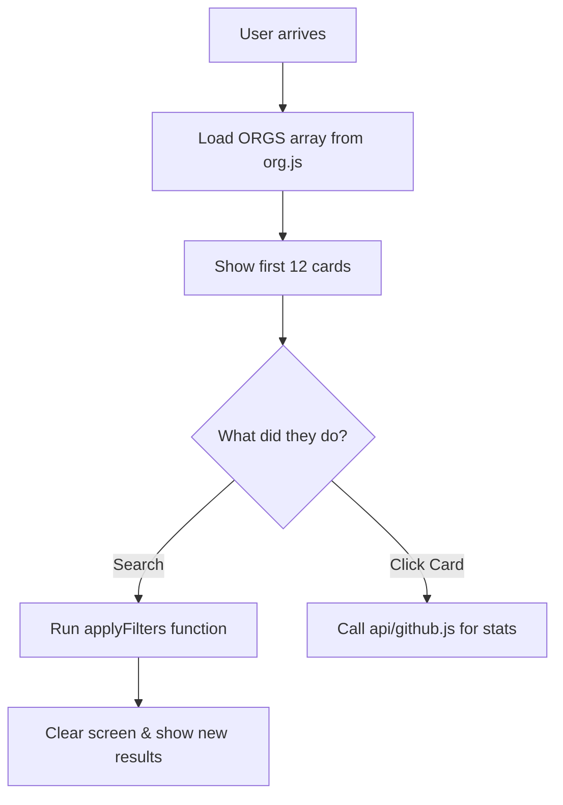

# Project Architecture & Workflow

Welcome to the GSoC Org Finder architecture guide. I wrote this to help new contributors, like me, understand how the project is put together. It explains where the data comes from and how the frontend interacts with the GitHub API.

---------------------------------------------------------------------------------------------------------

## 🏗 Frontend Structure

The frontend is a single-page application (SPA) built with vanilla JavaScript, HTML5, and Tailwind CSS.

### Key Files
- **`index.html`**: The entry point. It has the application's UI structure and some small scripts at the bottom for the menu and dark mode.
- **`src/js/app.js`**:This is the 'brain' of the app. It manages the search bar and the filters and it actually renders the cards on the screen.
- **`src/js/org.js`**:  This provides the data for organizations. *Note*:- that the live application currently loads this data from **`agent/scripts/orgs.js`**, which is a mirrored version of this file.
- **`src/styles.css`**:It contains global styles, custom animations, and theme-specific overrides that complement Tailwind CSS.
- **`src/js/recommender.js` & `recommendation-ui.js`**: These files handle the AI-powered recommendation feature, matching user profiles with organization data.

---------------------------------------------------------------------------------------------------------

## 🔄 Data Flow

### 1. Organization Data Loading
1. The `ORGS` array is loaded from `src/js/org.js` (or `agent/scripts/orgs.js` in some versions).
2. When the app loads, the `renderOrgs()` function in `index.html` (or `app.js`) takes the data and appends it to the DOM.

### 2. Filtering & Search
1. The user interacts with filter chips, search input, or dropdowns.
2. `applyFilters()` is triggered, which iterates through the `ORGS` array.
3. Filters are additive: `matchAllLanguages` determines if multi-language selection uses AND or OR logic.
4. The filtered list is then sorted (A-Z, Stars, GFI, etc.) and Shown again..

### 3. Rendering Lifecycle
- **Initial Render**: Shows the first 12 organizations.
- **Lazy Loading**: "Load More" appends the next chunk of 12 items.
- **Dynamic Updates**: Filtering clears the grid and re-renders based on the active subset.

---------------------------------------------------------------------------------------------------------

## 🌐 API Integration

The project connects to the GitHub API via a serverless proxy to handle security and performance.

### `api/github.js` (Vercel Edge Function)
- **Request Handling**: Proxies requests to `api.github.com`.
- **Caching Strategy**: 
  - Uses an in-memory `Map` with a 1-hour TTL.
  - Implements `safeCacheSet` to limit cache size and prevent memory leaks.
- **Rate-Limit Handling**: 
  - Requests are authenticated using `GITHUB_TOKEN`.
  - Heavy operations (like searching for Good First Issues) are separated from general stat fetches to minimize rate-limit consumption.
- **Modes**:
  - `user`: Fetches user profile for AI recommendations.
  - `gfi`: Fetches "Good First Issue" counts.
  - `issues`: Fetches actual issue metadata for the Issues section.

---------------------------------------------------------------------------------------------------------

## 🗺 Feature Mapping

| Feature | Primary File(s) |
| :--- | :--- |
| Theme Toggle | `index.html`, `src/js/app.js` |
| Org Filtering | `index.html`, `src/js/app.js` |
| AI Recommender | `src/js/recommender.js`, `src/js/skillExtractor.js` |
| Live GitHub Stats | `api/github.js`, `src/js/app.js` |
| Watchlist/Bookmarks | `index.html`, `localStorage` |
| Mentor Finder | `src/js/app.js`, `data/mentors.json` |

---------------------------------------------------------------------------------------------------------

## 🤝 Contributor Guidance

### Beginner-Friendly Areas
- **`data/`**: You can easily update organization stats here.
- **`src/styles.css`**: Good for fixing UI bugs or adding animations.

### Tricky Parts (Read this first!)
- **The 'Load More' Reset**: Be careful! If you have clicked 'Load More' a few times and then change a filter, the grid resets to the first 12 items. 
- **Two Org Files**: It’s easy to get confused because there is a `src/js/org.js` and an `agent/scripts/orgs.js`. Always check which one the app is actually calling in your version!

### Core Modules
- **`api/github.js`**: This **connects** to GitHub. Be careful with changes here as they can hit rate limits.
---------------------------------------------------------------------------------------------------------

## 📊 Application Workflow

---------------------------------------------------------------------------------------------------------